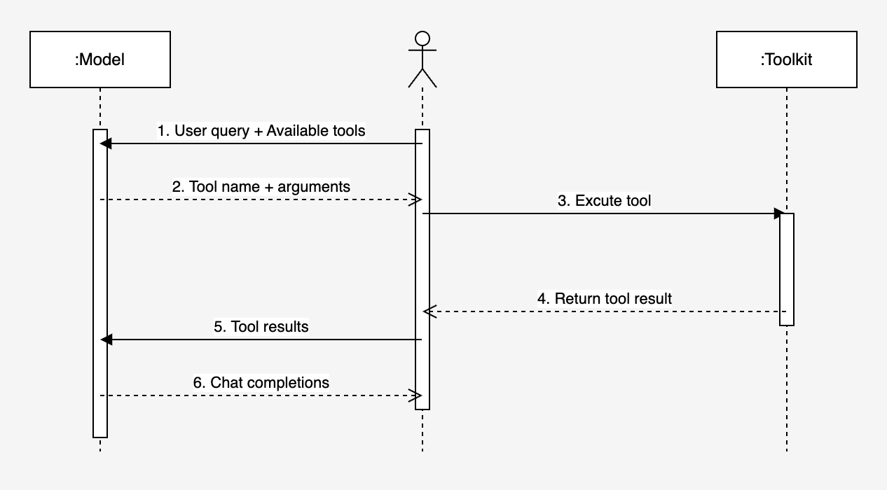

# Tool Use

## Introduction

Fig.1 shows the basic interactions between three roles (front end, LLM and toolkit) in the scenario of tool use.

<figure style="text-align: center;">
  
  <figcaption>Fig.1 Diagram of Tool Use.</figcaption>
</figure>

## Explanation and Examples

- Step 1: Send a request with user query and available tools
  The following shows the JSON format of a user request. The request includes a `user query`, available `tools`, and the `tool choice`. The tool choice can be `auto` (the model can pick between generating a message or calling one or more tools), `none` (the model will not call any tool and instead generates a message), or `required` (the model must call one or more tools).

  <details> <summary> Expand to see the example </summary>

    ```json
    {
        "model": "Mistral-7B-Instruct-v0.3",
        "messages": [
            {
                "role": "user",
                "content": "Hey! What is the weather like in auckland?"
            }
        ],
        "tools": [
            {
                "type": "function",
                "function": {
                    "name": "get_current_weather",
                    "description": "Get the current weather in a given location",
                    "parameters": {
                        "type": "object",
                        "properties": {
                            "location": {
                                "type": "string",
                                "description": "The city and state, e.g. San Francisco, CA"
                            },
                            "format": {
                                "type": "string",
                                "enum": [
                                    "celsius",
                                    "fahrenheit"
                                ],
                                "description": "The temperature unit to use. Infer this from the users location."
                            }
                        },
                        "required": [
                            "location",
                            "format"
                        ]
                    }
                }
            },
            {
                "type": "function",
                "function": {
                    "name": "predict_weather",
                    "description": "Predict the weather in 24 hours",
                    "parameters": {
                        "type": "object",
                        "properties": {
                            "location": {
                                "type": "string",
                                "description": "The city and state, e.g. San Francisco, CA"
                            },
                            "format": {
                                "type": "string",
                                "enum": [
                                    "celsius",
                                    "fahrenheit"
                                ],
                                "description": "The temperature unit to use. Infer this from the users location."
                            }
                        },
                        "required": [
                            "location",
                            "format"
                        ]
                    }
                }
            }
        ],
        "tool_choice": "auto", // "auto", "none", "required"
        "stream": true
    }
    ```

  </details>

- Step 2: Return a response of tool call

  The following shows the JSON format of a response from the LLM. The response includes the `selected tool` and the `tool output`. The tool output can be a `message` or a `function`.

  <details> <summary> Expand to see the example </summary>

    ```json
    {
        "id": "chatcmpl-28bc40a5-b271-4028-80df-558edee95d07",
        "object": "chat.completion",
        "created": 1719200026,
        "model": "Mistral-7B-Instruct-v0.3",
        "choices": [
            {
                "index": 0,
                "message": {
                    "content": "[{\"name\":\"get_current_weather\",\"arguments\":{\"location\": \"Auckland, NZ\", \"format\": \"celsius\"}}]",
                    "tool_calls": [
                        {
                            "id": "call_abc123",
                            "type": "function",
                            "function": {
                                "name": "\"get_current_weather\"",
                                "arguments": "{\"format\":\"celsius\",\"location\":\"Auckland, NZ\"}"
                            }
                        }
                    ],
                    "role": "tool_call"
                },
                "finish_reason": "tool_calls",
                "logprobs": null
            }
        ],
        "usage": {
            "prompt_tokens": 234,
            "completion_tokens": 84,
            "total_tokens": 318
        }
    }
    ```

  </details>

- Step 3: Execute tool

  The front end extracts the tool name and arguments from the tool call message, and then executes the tool. Note that tools could be a group of built-in functions or external APIs. The tool execution could be synchronous or asynchronous, depending on the tool implementation.

- Step 4: Return tool result

  After the tool execution, the front end receives the tool result.

- Step 5: Feed tool result to LLM

  Package the tool result into a tool message and send it to the LLM.

  <details> <summary> Expand to see the example </summary>

    ```json
    {
        "model": "Mistral-7B-Instruct-v0.3",
        "messages": [
            {
                "role": "user",
                "content": "Hey! What is the weather like in auckland?"
            },
            {
                "role": "tool_call",
                "content": "[{\"name\":\"get_current_weather\",\"arguments\":{\"location\":\"Auckland, NZ\",\"format\":\"celsius\"}}]"
            },
            {
                "role": "tool",
                "content": "Fine, with a chance of showers."
            }
        ],
        "tools": [
            {
                "type": "function",
                "function": {
                    "name": "get_current_weather",
                    "description": "Get the current weather in a given location",
                    "parameters": {
                        "type": "object",
                        "properties": {
                            "location": {
                                "type": "string",
                                "description": "The city and state, e.g. San Francisco, CA"
                            },
                            "unit": {
                                "type": "string",
                                "enum": [
                                    "celsius",
                                    "fahrenheit"
                                ]
                            }
                        },
                        "required": [
                            "location"
                        ]
                    }
                }
            },
            {
                "type": "function",
                "function": {
                    "name": "predict_weather",
                    "description": "Predict the weather in 24 hours",
                    "parameters": {
                        "type": "object",
                        "properties": {
                            "location": {
                                "type": "string",
                                "description": "The city and state, e.g. San Francisco, CA"
                            },
                            "unit": {
                                "type": "string",
                                "enum": [
                                    "celsius",
                                    "fahrenheit"
                                ]
                            }
                        },
                        "required": [
                            "location"
                        ]
                    }
                }
            }
        ],
        "tool_choice": "auto",
        "stream": true
    }
    ```

  </details>

- Step 6: Return chat completions

  LLM generates a chat completion with the user query and the tool result.

  <details> <summary> Expand to see the example </summary>

  For the purpose of demonstration, the following example is generated by the LLM in the `stream = false` mode.

    ```json
    {
        "id": "chatcmpl-b0db39c1-67e9-457a-be82-f7b3ca1489e9",
        "object": "chat.completion",
        "created": 1719211344,
        "model": "Mistral-7B-Instruct-v0.3",
        "choices": [
            {
                "index": 0,
                "message": {
                    "content": "Today in Auckland, the current weather is fine but there's a chance of showers. Make sure to check the forecast for any potential changes throughout the day!",
                    "tool_calls": [],
                    "role": "assistant"
                },
                "finish_reason": "stop",
                "logprobs": null
            }
        ],
        "usage": {
            "prompt_tokens": 60,
            "completion_tokens": 36,
            "total_tokens": 96
        }
    }
    ```

  </details>
